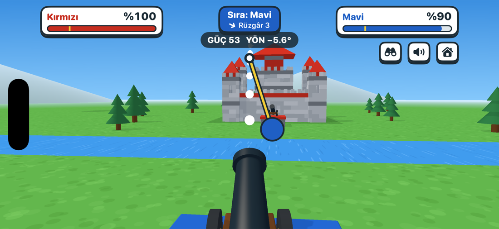

# Kale Savaşı

A two-player castle battle. Players take turns firing a cannon at each other's castle; the
castle that drops below 20 % of its structure loses. Play against the computer, on one device,
or online.

- [`ios/KaleSavasi`](ios/KaleSavasi) is the game: a native iOS app in Swift (SceneKit and
  SwiftUI). Its [README](ios/KaleSavasi/README.md) covers running it, the controls and the
  Game Center setup.
- [`web-prototype`](web-prototype) is the earlier browser prototype (Three.js). It keeps the
  first design, with brick-style castles and slider controls, and is not kept in step with
  the app.

